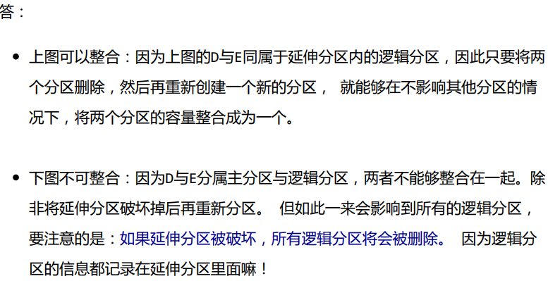
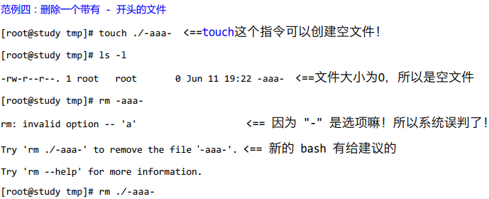

# CH0 计算机概论

+ 计算机组成单元

  计算机组成：输入单元、处理单元（CPU内部控制单元+算术逻辑单元）、输出单元、存储单元（外部存储器+CPU内部的主存储器）。

  `数据都是流经CPU内部的主存储器在转出去的，至于数据会流进/流出内存则是CPU发出的控制命令实现，实际处理的数据完全来自主存储器`

+ CPU种类

  1. 精简指令集(Reduced Instruction Set Computing, RISC)

     完成动作单一，执行时间短

     *常见的RISC 微指令集 CPU 例如Sun公司的 SPARC 系列、 IBM 公司的Power Architecture(包括 PowerPC)系列、不 ARM 系 列等*

  2. 复杂指令集(Complex Instruction Set Computer, CISC)

     每个指令集成了一些较低阶的硬件操作，指令数目多且杂，执行时间较长，处理的工作较为丰富。

     *Intel/AMD 的x86 架构CPU*

  `指令集：软件都经过CPU内部转换成微指令来执行`

  

+ 接口设备

  最重要的接口设备--主板（负责将所有设备通通连一起）

  主板最重要的组件--主板芯片组（将所有设备汇集一起）

  芯片组分两个网桥与各组件交互

  1. 北桥：负责速度快的组件，CPU、主存储器、显示适配器等组件
  2. 南桥：负责连接速度较慢的组件，硬盘、USB、网卡等 

  次要设备--存储设备、显示设备、网络设备（网卡）

+ 容量单位

  | 进制位 | K    | M     | G     | T     | P     |
  | ------ | ---- | ----- | ----- | ----- | ----- |
  | 二进制 | 1024 | 1024K | 1024M | 1024G | 1024T |
  | 十进制 | 1000 | 1000K | 1000M | 1000G | 1000T |

+ 速度单位

  CPU指令周期常用单位MHz或GHz，Hz其实是秒分之一。

  *CPU主频为3Ghz表示1秒能进行3x10^9次工作（一次工作运行少数的指令），若外频为333Mhz，则倍频为9倍。3G = 333M x 9*

  + 外频（通常超频是指拉高外频）

    是指CPU与外部组件进行数据传输时的速度

  + 倍频（通常被厂家锁定，无法修改）

    是指CPU内部用来加速工作效能的一个倍数
  
    `主频 = 外频 x 倍频`
  
  网络使用单位为Mbps（Mbit per second）
  
  *8M ADSL --> 1Mbyte/s*
  
  *1M ADSL --> 125Kbyte/s*
  
+ 带宽

  北桥支持的频率称为前端总线速度（Front Side Bus，FSB）（通常为内存频率1066/1333/1600Mhz），每次传送数据的位数为总线宽度。常见的总线宽度为32bit/64bit。

  举例：内存与北桥的带宽为12.8GBytes/s 

  即1600Mhz x 64bits = 1600Mhz x 8Bytes = 12800MBytes/s = 12.8GBytes/s 

+ 内存

  主存储器（内存）主要组件为动态随机存取内存（dynamic random access memory，DRAM）`需在通电状态使用，断电数据丢失，也称为这种RAM为挥发行内存`

  + DRAM 技术更新分好几代（由旧到新）

    + SDRAM

    + DDR SDRAM（DDR、DDRⅡ、DDRⅢ、DDR4）

      DDR 是指双倍数据传送（Double Data Rate，一个工作周期进行两次数据传送，类似CPU倍频）

  

+ 双通道设计

  拓展传统总线的宽度，将两个内存汇总在一起以达到128bit，就是双通道的设计理念。

+ DRAM与SRAM(Static Random Access Memory,SRAM)

  

  L2 cache就是静态随机存储内存，SRAM在设计上使用晶体管数量较多，价格高不易做成大容量，但其速度快，因此整合到CPU成为高速缓存。

+ 只读存储器ROM

  BIOS（basic input output system）是系统开机首先会去读取的小程序，控制着开机时各项硬件参数，CMOS将记录这些参数到ROM中，这些参数包括系统时间、CPU电压与频率、各项设备的IO地址、IRQ中断信道等。

  *记录需要用电，所以主板上还有个小电池专门用来供电，断电数据不会丢失*

+ 闪存flash和EEPROM

  现在BIOS也需要更新，而ROM又是无法修改的，所以现在BIOS通常写入闪存flash和EEPROM中。

+ 固态硬盘SSD（solid state disk）

  厂商用闪存做的，数据延迟低、省电、寿命较机械硬盘短。

+ 显卡插槽

  

  

+ 操作系统

  简单理解为核心和相关的用户应用软件。只管理整个硬件资源（CPU、内存、输入输出装置及文件系统文件。）

  *如果没有用户软件的辅助，操作系统只能让计算机Ready而已*

+ 驱动程序

  驱动硬件在操作系统上正常运行。驱动程序由厂商提供，与操作系统开发者无关。

+ 应用程序

  依托操作系统提供的开发接口所开发出来的软件。
  
  
  
  

# CH1 Linux是什么 

1. Linux的历史

   Linus Torvalds开发Linux核心

   POSIX（Portable Operating System Interface）可携式操作系统接口

   树莓派/香蕉派/智能型手机/平板的ARM架构系统大多也使用Linux核心

2. Linux是架站首选（具备计算机基础和网络基础相关知识）

3. 网络服务问题，到/var/log/目录中查询log file文件解决

4. 设备在linux中以文件的形式存在，常用设备如下表

| 设备                | 路径                       |
| ------------------- | -------------------------- |
| SCSI/SATA/USB硬盘机 | /dev/sd[a-p]               |
| USB闪存盘           | /dev/sd[a-p]（与SATA相同） |
| VirtI/O界面         | /dev/vd[a-p]               |
| 25针打印机          | /dev/lp[0-2]               |
| USB接口打印机       | /dev/lp[0-15]              |
| 通用鼠标            | /dev/input/mouse[0-15]     |
| PS/2界面鼠标        | /dev/mouse                 |
| 当前鼠标            | /dev/mouse                 |
| CDROM/DVDROM        | /dev/scd[0-1]              |

​    


# CH2 主机规划与磁盘分区   

磁盘分区演进：MBR -> GPT

   

所谓分区是针对64 Bytes进行分区设置，默认的分区表仅能写入四组分区信息，这四个分区的记录被称为主要（Primary）或延伸（Extended）分区。延伸分区最多只能有一个且不能被格式化（操作系统限制，当然可以没有延伸分区）。

分区的最小单位“通常”为柱面。

超过四个区是通过延伸分区的方式处理。分出的区域为逻辑分区。





GPT分区已经没有延伸分区与逻辑分区的概念，你可以想象所有分区都是主分区。


开机流程

**BIOS -> MBR -> boot loader -> 核心文件 -> 操作系统**

1. BIOS：开机主动执行的固件，会认识第一个可开机的设备；
2. MBR：第一个可开机设备的第一个扇区内的主要开机记录区块，内含开机管理程序。
3. 开机管理程序（boot loader）：一支可读取核心文件来执行的软件；
   + 提供菜单：使用者可以选择不同的开机项目，这也是多重开机的重要功能。
   + 载入核心文件：直接指向可开机的程序区段来开始操作系统。
   + 转交其他loader：将开机管理功能转交给其他loader负责。
4. 核心文件：开始操作系统的功能...

UEFI与BIOS

文件系统与目录数的关系

挂载：利用一个目录当成进入点，将磁盘分区的数据放置在该目录下。


# CH3 安装CentOS 7.x


swap：磁盘仿真成为内存，由于swap并不会使用目录树的挂载，所以用sawp就不需要指定挂载点。

xfs：CentOS默认的文件系统。


# CH4 首次登陆与线上求助


基础指令操作


Ctrl+d 代表exit

Shift+Page Up 代表向前翻页

Shift+Page Down 代表向后翻页

man

​		是manual（操作说明的简写）

​		man date将输出以下信息，*在此页面中输入 /abc ，可以对abc进行向下查找，输入？abc，可以对abc进行向上搜索，搜索后按n进行向下搜索，按N进行向上搜索*。

​		

括号中1的含义：(`表中1，5，8三个号码特别重要，必须熟记`)


超简单文本编辑器 -- nano

nano text.txt#打开一text.txt文件


按Ctrl+G或F1 能调出详细说明


正确的关机指令使用

+ 将数据同步写入硬盘中的指令 sync
+ 惯用的关机指令 shutdown
+ 重新开机，关机 reboot，halt，poweroff


# CH5 Linux的文件权限与目录配置

Linux一般将文件的身份分为三个类别：owner/group/others

这三种身份均拥有三种权限：read/write/execute


`root不受权限的限制，默认root都能访问，即使权限为---------`

改变文件属性与权限

+ chgrp 改变文件所属群组

  ```shell
  chgrp users file.txt
  如果连同目录下的所有次目录或者文件同时更改文件拥有者的话，直接加上-R的选项即可 
  ```

+ chown 改变文件拥有者

  ```shell
  chown [-R] 用户拥有者 文件或目录
  chown [-R] 用户拥有者：群组名称 文件或目录
  如果连同目录下的所有次目录或者文件同时更改文件拥有者的话，直接加上-R的选项即可 
  ```

  

+ chmod 改变文件的权限，SUID,SGID,SBIT等等特性

  - 各权限分数对照表

    r：4

    w：2

    x：1

    eg  -rwx rwx ---

    ​		owner = rwx = 4+2+1=7

    ​		group = rwx = 4+2+1=7

    ​		others = --- = 0+0+0=0

    ````
    chmod 644 .bashrc
    ````

  - 符号类型改变文件权限

    

    ```
    #设置权限-rwxr-xr-x
    chmod u=rwx,go=rx .bashrc #注 中间没有空白
    #设置权限-rwxr-xr--
    chmod u=rwx,g=rx,o=r .bashrc
    #给每个人增加写入权限
    chmod a+w .bashrc
    #去掉每个人的写入权限
    chmod a-w .bashrc #注 去掉不存在的权限不会报错
    ```

+ 权限对目录的重要性

  上述权限只针对文件属性，而并不具备删除文件本身的权限

  目录中rwx的重新定义

  + r （read contents in directory）

    表示可以查看目录的文件名，用ls可以将其显示出来

  + w （modify contents of diectory）

    你拥有以下权限

    + 创建新的文件和目录
    + 删除已经存在的文件和目录
    + 将已存在的文件或目录更名
    + 搬移该目录内的文件、目录位置

  + x （access directory）

    与执行文件不同，目录x代表的是使用者能否进入该目录成为工作目录。而切换目录的命令为cd，所以没有x，你cd不进去这个目录。

  

  说明：

  我们看到root目录下，用户权限为rwx，却无法删除文件，就是因为它不是目录的拥有者。

  所以，tnt用户删除不了该目录中任何一个文件

  ```
  drwxr-xr-x  1 root root    512 Jan 26 22:06 bin
  #可以删除自身目录下的文件，因为该目录用户拥有w权限 
  tnt@TNT-PC:~$ pwd
  /home/tnt
  tnt@TNT-PC:~$ ls -l
  total 497788
  -rwxr-xr-x 1 root root      5047 Jan 26 22:08 znew
  ```

  

  表格解析：其实r是非必备的，相当摸黑你也能操作文件夹，如上图表格表格中最后一个权限。但没有r的话，你的TAB不能补齐哦。

  所以，通常开放的目录会具备rx这两个权限。而w涉及删除操作，需谨慎对待。

  

+ 常规文件 regular file

  + 纯文本文件 

    可以用cat读出来

  + 二进制文件

    可执行文件，例如cat本身就是个二进制文件

  + 数据格式文件

    它属于特殊格式的文件，可以用last命令读出来

    

  + 目录

  + 链接文件

    类似快捷方式

  + 设备与设备文件

    + 区块block设备文件 硬盘、软盘等
    + 字符character设备文件 键盘、鼠标等

  + 数据接口文件 sockets

    可通过sockets进行通信

  + 管道文件（FIFO， pipe）

+ 具备可执行权限不一定具备可执行的程序码，只有两者均具备的文件才能被执行。Linux的文件没有所谓的“扩展名”。

Linux文件名称限制

​		最好避免以下一些特殊字符比较好：

```
*? > < ; & ! [ ] | \ ' " " ' ( ) { } . - + 
```

Linux目录配置的依据 -- FHS

+ / （ root, 根目录） ： 与开机系统有关；

+ /usr （ unix software resource） ： 与软件安装/执行有关；

+ /var （ variable） ： 与系统运行过程有关 。

+ FHS标准建议

  根目录所在分区应该越小越好，且应用程序所安装的软件最好不要与根目录放在同一个分区内，保持根目录越小越好。如此不但性能较佳，也不容易发生问题。


# CH6 Linux文件与目录管理

shell scripts建议使用绝对路径

```
. 			代表此层目录
.. 			代表上一层目录
- 			代表上一次访问的目录
~ 			代表“目前使用身份”所在的主文件夹
~account 	代表account这个使用者所在的主文件夹
```

cd 

cd - 切换到上一次访问的工作目录

pwd 是Print Working Directory的缩写，显示当前目录（若是链接目录，显示的是链接目录而非实际目录）

pwd -P 与pwd区别在于，-P表示的是实际目录，而非链接目录

mkdir

```
-m 设置文件夹的权限
mkdir -m 711 test
-p 递归创建目录
mkdir -p test1/test2/test3/test
```

echo $PATH 显示环境变量

PATH ="${PATH}:/root" 添加环境变量

不建议将“.”加入PATH的搜索目录中

文件与目录管理

+ ls

  

  ```
  modification time （ mtime）：
  文件内容变更会对该时间进行更新。
  
  status time （ ctime） ：
  权限或属性改变会更新此时间
  
  access time （ atime） ：
  文件被读取会更新此时间
  
  eg
  date; ls -l /etc/man_db.conf ; ls -l --time=atime /etc/man_db.conf ; \
  > ls -l --time=ctime /etc/man_db.conf
  ```

  

+ 复制、移动、删除：cp，rm，mv

  cp

  

  `默认条件下，cp的来源文件与目标文件的权限是不同的，目标文件的拥有者通常会是指令操作者本身，需要和来源文件一致，可以使用-a或是-p选项`	

  

  ``可以将多个文件一次复制进同一目录，注意最后一个一定是目录`

  ```
   cp ~/.bashrc ~/.bash_history /tmp  
  ```

+ rm

    

  ```
  #在指令前加反斜线，可以忽略alias的指定选项，即删掉目录而不提示
  \rm -r /tmp/etc
  ```

  

  

+ mv 

  

取得路径的文件名称与目录名称


文件内容查阅

+ cat 由第一行开始显示文件内容

  

+ tac 从最后一行开始显示，与cat显示方式相反

+ nl 显示的时候，顺道输出行号

  

+ more 一页一页的显示文件内容

  

+ less与more类似，但是比more更好的是，它可以往前翻页

  

+ head 只看头几行

  

+ tail 只看尾巴几行

  

+ od 以二进制的方式读取文件内容 （？ 命令od -t oCc /etc/issue存疑）

  

+ touch （选项中的时间可参照第6章ls）

  默认不接参数，atime/ctime/mtime 为当前时间

  

文件与目录的默认权限与隐藏权限

文件默认权限 umask

+ umask -S查看
+ 文件默认权限为666，默认没有可执行权限，即-rw-rw-rw
+ 目录默认权限为777，即drwxrwxrwx
+ 若设置umask为002即输入命令 umask 002，则创建文件的默认权限为666-002=664，这个在Samaba Server和FTP Server当中很有用。
+ 出于安全考虑，root的umask会拿掉比较多的属性，通常umask为022

设置文件隐藏属性 chattr


显示文件隐藏属性 lsattr


文件特殊权限：SUID,SGID,SBIT

+ SUID

  举例：用户可以自行更改密码，而密码文件的所有权为root

  1.dmtsai 对于 /usr/bin/passwd 这个程序来说是具有 x 权限的， 表示
  dmtsai 能执行 passwd；
  2.passwd 的拥有者是 root 这个帐号；
  3.dmtsai 执行 passwd 的过程中， 会“暂时” 获得 root 的权限；
  4./etc/shadow 就可以被 dmtsai 所执行的 passwd 所修改

  

+ SGID

  目录具有SGID的特殊权限时，代表使用者在这个目录下面新建文件的群组都会和该目录的群组名称相同

  **todo 待补充**

+ SBIT

  目录具备SBIT的特殊权限时，代表在该目录下使用者创建的文件只有自己与root能够删除

  **todo 待补充**

file 文件名

​		可以简单获取文件信息

文件查找

+ which 寻找可执行文件 

  参数-a 可以列出所有PATH目录中的命令

+ find不常用 搜索硬盘的文件系统 速度慢**todo 待补充**

  

  

  

+ whereis 在某些特定的目录中寻找文件文件名

  

+ locate / updatedb 利用数据库搜索文件名

  

  