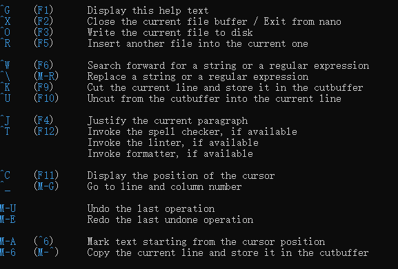

# 计算机概论

+ 计算机组成单元

  计算机组成：输入单元、处理单元（CPU内部控制单元+算术逻辑单元）、输出单元、存储单元（外部存储器+CPU内部的主存储器）。

  `数据都是流经CPU内部的主存储器在转出去的，至于数据会流进/流出内存则是CPU发出的控制命令实现，实际处理的数据完全来自主存储器`

+ CPU种类

  1. 精简指令集(Reduced Instruction Set Computing, RISC)

     完成动作单一，执行时间短

     *常见的RISC 微指令集 CPU 例如Sun公司的 SPARC 系列、 IBM 公司的Power Architecture(包括 PowerPC)系列、不 ARM 系 列等*

  2. 复杂指令集(Complex Instruction Set Computer, CISC)

     每个指令集成了一些较低阶的硬件操作，指令数目多且杂，执行时间较长，处理的工作较为丰富。

     *Intel/AMD 的x86 架构CPU*

  `指令集：软件都经过CPU内部转换成微指令来执行`

  

+ 接口设备

  最重要的接口设备--主板（负责将所有设备通通连一起）

  主板最重要的组件--主板芯片组（将所有设备汇集一起）

  芯片组分两个网桥与各组件交互

  1. 北桥：负责速度快的组件，CPU、主存储器、显示适配器等组件
  2. 南桥：负责连接速度较慢的组件，硬盘、USB、网卡等 

  次要设备--存储设备、显示设备、网络设备（网卡）

+ 容量单位

  | 进制位 | K    | M     | G     | T     | P     |
  | ------ | ---- | ----- | ----- | ----- | ----- |
  | 二进制 | 1024 | 1024K | 1024M | 1024G | 1024T |
  | 十进制 | 1000 | 1000K | 1000M | 1000G | 1000T |

+ 速度单位

  CPU指令周期常用单位MHz或GHz，Hz其实是秒分之一。

  *CPU主频为3Ghz表示1秒能进行3x10^9次工作（一次工作运行少数的指令），若外频为333Mhz，则倍频为9倍。3G = 333M x 9*

  + 外频（通常超频是指拉高外频）

    是指CPU与外部组件进行数据传输时的速度

  + 倍频（通常被厂家锁定，无法修改）

    是指CPU内部用来加速工作效能的一个倍数
  
    `主频 = 外频 x 倍频`
  
  网络使用单位为Mbps（Mbit per second）
  
  *8M ADSL --> 1Mbyte/s*
  
  *1M ADSL --> 125Kbyte/s*
  
+ 带宽

  北桥支持的频率称为前端总线速度（Front Side Bus，FSB）（通常为内存频率1066/1333/1600Mhz），每次传送数据的位数为总线宽度。常见的总线宽度为32bit/64bit。

  举例：内存与北桥的带宽为12.8GBytes/s 

  即1600Mhz x 64bits = 1600Mhz x 8Bytes = 12800MBytes/s = 12.8GBytes/s 

+ 内存

  主存储器（内存）主要组件为动态随机存取内存（dynamic random access memory，DRAM）`需在通电状态使用，断电数据丢失，也称为这种RAM为挥发行内存`

  + DRAM 技术更新分好几代（由旧到新）

    + SDRAM

    + DDR SDRAM（DDR、DDRⅡ、DDRⅢ、DDR4）

      DDR 是指双倍数据传送（Double Data Rate，一个工作周期进行两次数据传送，类似CPU倍频）

  

+ 双通道设计

  拓展传统总线的宽度，将两个内存汇总在一起以达到128bit，就是双通道的设计理念。

+ DRAM与SRAM(Static Random Access Memory,SRAM)

  

  L2 cache就是静态随机存储内存，SRAM在设计上使用晶体管数量较多，价格高不易做成大容量，但其速度快，因此整合到CPU成为高速缓存。

+ 只读存储器ROM

  BIOS（basic input output system）是系统开机首先会去读取的小程序，控制着开机时各项硬件参数，CMOS将记录这些参数到ROM中，这些参数包括系统时间、CPU电压与频率、各项设备的IO地址、IRQ中断信道等。

  *记录需要用电，所以主板上还有个小电池专门用来供电，断电数据不会丢失*

+ 闪存flash和EEPROM

  现在BIOS也需要更新，而ROM又是无法修改的，所以现在BIOS通常写入闪存flash和EEPROM中。

+ 固态硬盘SSD（solid state disk）

  厂商用闪存做的，数据延迟低、省电、寿命较机械硬盘短。

+ 显卡插槽

  

  

+ 操作系统

  简单理解为核心和相关的用户应用软件。只管理整个硬件资源（CPU、内存、输入输出装置及文件系统文件。）

  *如果没有用户软件的辅助，操作系统只能让计算机Ready而已*

+ 驱动程序

  驱动硬件在操作系统上正常运行。驱动程序由厂商提供，与操作系统开发者无关。

+ 应用程序

  依托操作系统提供的开发接口所开发出来的软件。

# CH1 Linux是什么 

1. Linux的历史

   Linus Torvalds开发Linux核心

   POSIX（Portable Operating System Interface）可携式操作系统接口

   树莓派/香蕉派/智能型手机/平板的ARM架构系统大多也使用Linux核心

2. Linux是架站首选（具备计算机基础和网络基础相关知识）

3. 网络服务问题，到/var/log/目录中查询log file文件解决

4. 设备在linux中以文件的形式存在，常用设备如下表

| 设备                | 路径                       |
| ------------------- | -------------------------- |
| SCSI/SATA/USB硬盘机 | /dev/sd[a-p]               |
| USB闪存盘           | /dev/sd[a-p]（与SATA相同） |
| VirtI/O界面         | /dev/vd[a-p]               |
| 25针打印机          | /dev/lp[0-2]               |
| USB接口打印机       | /dev/lp[0-15]              |
| 通用鼠标            | /dev/input/mouse[0-15]     |
| PS/2界面鼠标        | /dev/mouse                 |
| 当前鼠标            | /dev/mouse                 |
| CDROM/DVDROM        | /dev/scd[0-1]              |

​    

# CH2 主机规划与磁盘分区   

磁盘分区演进：MBR -> GPT

   

所谓分区是针对64 Bytes进行分区设置，默认的分区表仅能写入四组分区信息，这四个分区的记录被称为主要（Primary）或延伸（Extended）分区。延伸分区最多只能有一个且不能被格式化（操作系统限制，当然可以没有延伸分区）。

分区的最小单位“通常”为柱面。

超过四个区是通过延伸分区的方式处理。分出的区域为逻辑分区。

GPT分区已经没有延伸分区与逻辑分区的概念，你可以想象所有分区都是主分区。

开机流程

**BIOS -> MBR -> boot loader -> 核心文件 -> 操作系统**

1. BIOS：开机主动执行的固件，会认识第一个可开机的设备；
2. MBR：第一个可开机设备的第一个扇区内的主要开机记录区块，内含开机管理程序。
3. 开机管理程序（boot loader）：一支可读取核心文件来执行的软件；
   + 提供菜单：使用者可以选择不同的开机项目，这也是多重开机的重要功能。
   + 载入核心文件：直接指向可开机的程序区段来开始操作系统。
   + 转交其他loader：将开机管理功能转交给其他loader负责。
4. 核心文件：开始操作系统的功能...

UEFI与BIOS

文件系统与目录数的关系

挂载：利用一个目录当成进入点，将磁盘分区的数据放置在该目录下。

# CH3 安装CentOS 7.x

swap：磁盘仿真成为内存，由于swap并不会使用目录树的挂载，所以用sawp就不需要指定挂载点。

xfs：CentOS默认的文件系统。

# CH4 首次登陆与线上求助

基础指令操作

Ctrl+d 代表exit

Shift+Page Up 代表向前翻页

Shift+Page Down 代表向后翻页

man

​		是manual（操作说明的简写）

​		man date将输出以下信息，*在此页面中输入 /abc ，可以对abc进行向下查找，输入？abc，可以对abc进行向上搜索，搜索后按n进行向下搜索，按N进行向上搜索*。

​		

括号中1的含义：(`表中1，5，8三个号码特别重要，必须熟记`)

超简单文本编辑器 -- nano

nano text.txt#打开一text.txt文件

按Ctrl+G或F1 能调出详细说明

正确的关机指令使用

+ 将数据同步写入硬盘中的指令 sync
+ 惯用的关机指令 shutdown
+ 重新开机，关机 reboot，halt，poweroff

# CH5 Linux的文件权限与目录配置

