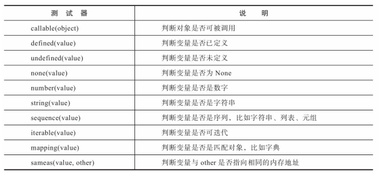
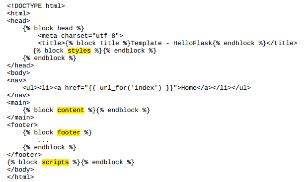
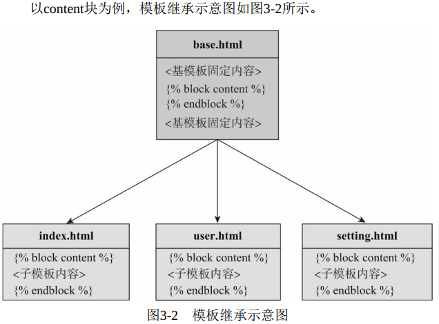

# 第一部分 基础篇

## 第一章 初识Flask


## 第二章 Flask与HTTP


## 第三章 模板

1. 模板的基本用法

   + 渲染模板

     变量传入

     <p>list第一个元素 {{ userlist[0] }}</p>
<p>tuple第一个元素 {{ usertuple[0] }}</p> 
     <p>字典my_dict的键为name的值： {{ my_dict['name'] }}</p><p>函数my_func的返回值： {{ my_func() }}</p><p>对象my_object调用某方法的返回值： {{ my_object.name() }}</p> 

2. 模板辅助工具

   + 上下文

     定义变量， 使用set标签：

     ```jinja2
       
     ```

     将一部分模板数据定义为变量， 使用set和endset标签声明
     开始和结束：

     ```jinja2
     
     <li><a href="/">Home</a>
     <li><a href="/about">About</a>
       
     ```

   + 全局对象

     全局函数（默认全局函数+自定义全局函数）

   + 过滤器（提取变量，并对变量使用过滤器（*函数*））

     ```jinja2
     {{ name|title }}  
     
     
     This text becomes uppercase.
       
     ```

   + 测试器（判断作用）

     

3. 模板结构组织

   + 局部模板（仅包含部分代码，不用在视图函数中直接渲染它，而是插入到其他独立模板中）

     eg 使用include插入一个局部模板（和普通模板区分，通常以下划线开始）

     `jinja2使用关键字时需要两端需要加%，与直接引用变量不一样`

     ```jinja2
     
     ```

   + 宏

     类似函数，可以把一部分模板代码封装成宏

     eg 单独存储宏到一个文件macros.html或_macros.html
     
     ```jinja2
     
       
     ​			I am qux.
       
     ​			We are quxs.
       
     
     
     ```
     
     利用导入的方式使用
     
     ```jinja2
     
     
     ...
     
     {{ qux(amount=5) }}
     ```
     
     **include与import区别 ？**
     
     
     
   + 模板继承
   
     基模板与继承
   
     

     

     

     子模板（子类可覆盖或追加父类的内容）

     ```jinja2
    
     
    
     
     
     <h1>Template</h1><ul><li><a href="{{ url_for('watchlist') }}">Watchlist</a></li>
     <li>Filter: {{ foo|musical }}</li>
     <li>Global: {{ bar() }}</li>
     <li>Test: I am baz.</li>
     <li>Macro: {{ qux(amount=5) }}</li>
     </ul>
      
     ```
   
     创建同名的块即可覆盖。
   
     追加内容

     ```jinja2
    
        {super()}}
        <style>
         		 .foo {
         			 color:  red;
         		 }
       </style>  
        
     ```
   
4. 模板进阶实践

   jinja2语句渲染后，jinja2语句的位置默认保留空行。

   解决方法：使用 - 号，或者设置属性。

   

   **todo 待验证**

   会移除该语句前的空白（\<i>与-之间？）， 同理， 在右边的定界符内侧添加减号将移除该语句后的空白。（\</i>与-之间？）

   ```jinja2
   
   		<i>{{ user.bio }}</i>
   
   		<i>This user has not provided a bio.</i>
     
   ```

   输出

   ```html
   <i>{{ user.bio }}</i>
   <i>This user has not provided a bio.</i>  
   ```

   设置属性

    *用来删除Jinja2语句后的第一个空行* 

   app.jinja_env.trim_blocks = True 

   *用来删除Jinja2语句所在行之前的格和制表符*

   app.jinja_env.lstrip_blocks = True  

   **注** 此方法对宏无效。宏内的空白控制行为不受trim_blocks和lstrip_blocks属性控制， 我们需要手动设置

   ```jinja2
   
   	
   		I am qux.
   	
   		We are quxs.
   	
   
   ```

   加载静态文件