# 概述

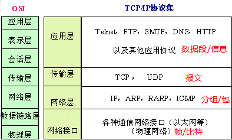

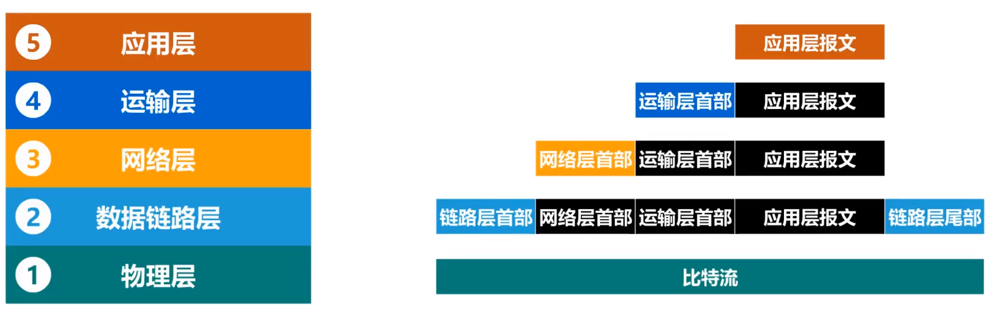

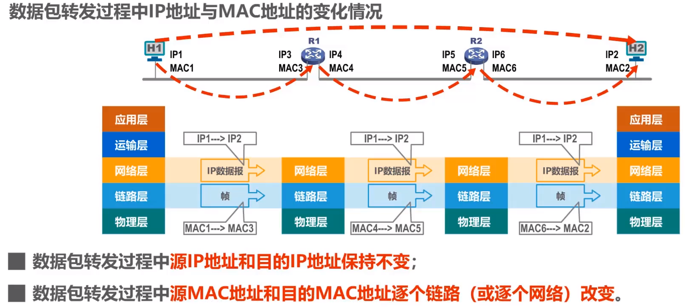

> MAC地址

+ mac地址属于数据链路层的范畴，而非物理层的概念
+ 它不能区分网络，所以接入internet需要mac地址和IP地址

> IP地址

+ 网络地址+主机地址

> ARP协议

+ 地址解析协议，根据IP地址获取MAC地址的一个TCP/IP协议。主机发送信息时将包含目标IP地址的ARP请求广播到网络上的所有主机，并接收返回消息，以此确定目标的MAC地址；收到返回消息后将该IP地址和MAC地址存入本机ARP缓存中并保留一段时间，下次请求时直接查询ARP缓存以节约资源。

+ ARP表

  主机的ARP高速缓存表，分两种类型 

  + 动态：自动获取，生命周期默认为两分钟
  + 静态：手工设置，不同操作系统下的生命周期不同，例如系统重启后不存在或者系统重启后依然有效。

  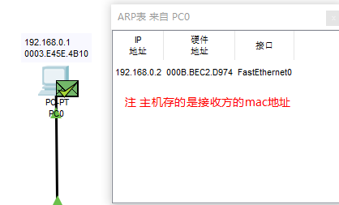

  APR不能跨网段进行

  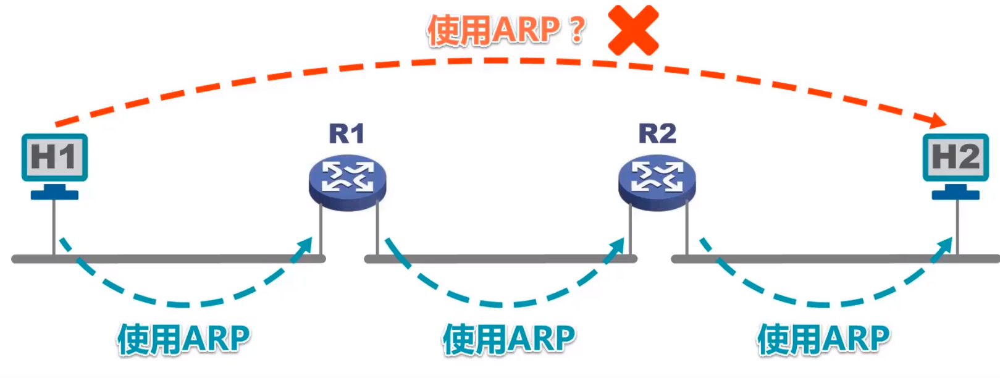

> 虚拟局域网VLAN

+  交换机的端口类型

  + Access

    Access端口默认与未设置的端口vlan id相同，即为1

    Access端口只能属于一个VLAN

    **未打标签的广播mac帧默认发给vlan=1的端口，而不是所有端口**

    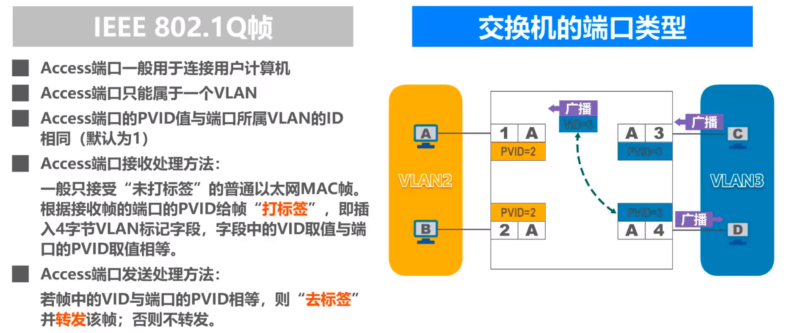

  + Trunk

    + Trunk可以属于多个端口（级联交换机用）
    + Trunk接收已打标签的帧时，**不相等直接转发（这点与Access不一样）**，相等则去标签转发

    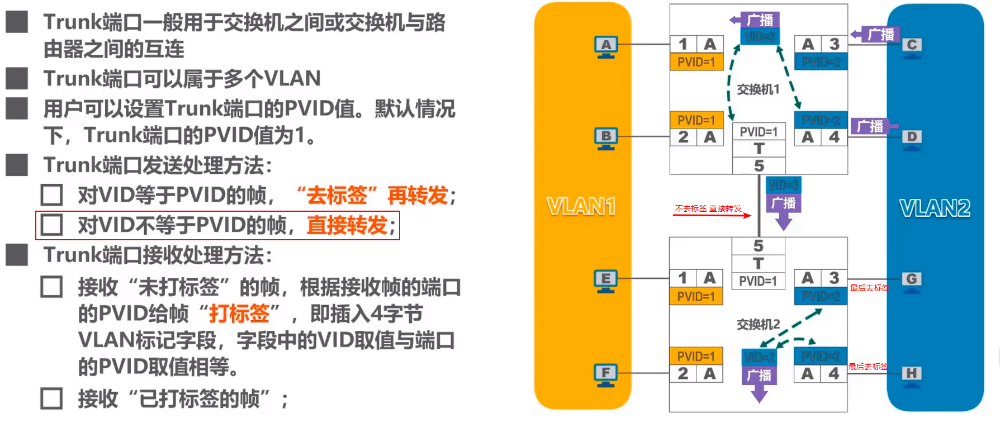

  + Hybrid（华为交换机独有）

    增加了发送的处理方法，其他方式与Trunk相同

    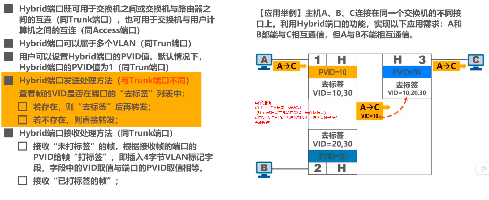

      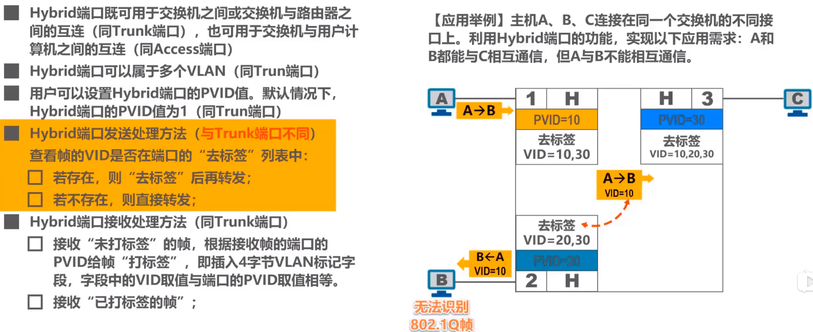

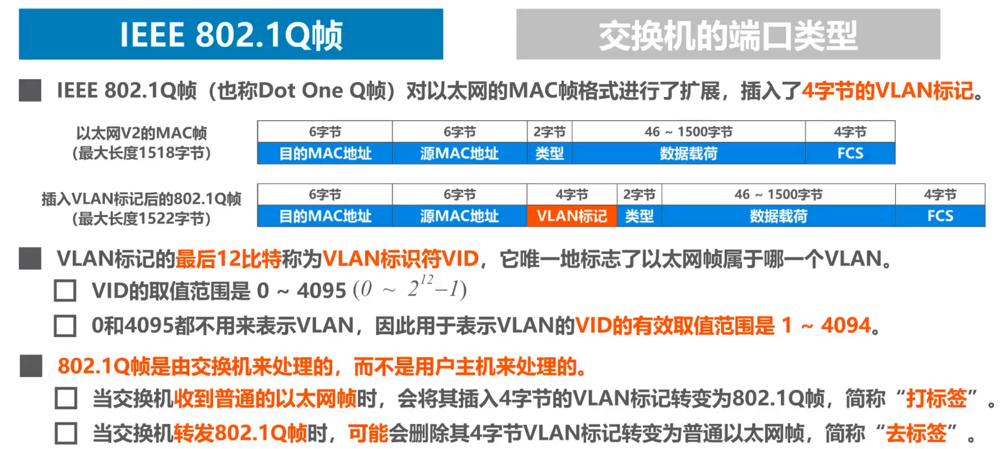          

# 访问WEB服务器

流程：

1. HTTP客户端给服务器发送一个HTTP请求。
2. Sent 报文段信息： 序号 1，ACK号 1，数据长度 100。
3. 目的IP地址与源IP地址在同一子网。设备把下一跳设置为目的IP地址。
4. 下一跳IP地址是一个单播地址。ARP进程在ARP表中查找它。
5. 下一跳IP地址在ARP表中。ARP进程设置帧的目的MAC地址为该IP地址在缓存中对应的MAC地址。
6.  设备将PDU封装到一个以太网帧中。
7.  端口FastEthernet0此时正在发送另一个帧。设备缓存该帧以便稍后发送。
8. 设备从缓冲区取出该帧并发送。
9. FastEthernet0发送帧。
10. FastEthernet0接收帧。
11. 该帧的目的MAC地址与接收端口的MAC地址、广播地址、或者多播地址匹配。
12. 设备从一个以太网帧中解封出PDU。
13. 数据包的目的IP地址与设备的IP地址或广播地址匹配。设备解封该数据包。
14. 设备在与(IP地址192.168.0.2, 端口1033)的连接上接收到一个TCP PUSH+ACK报文段。
15.  Received 报文段信息： 序号 1，ACK号 1，数据长度 100。
16. TCP报文段具有所期望的对等序号。
17. TCP处理负载数据。
18. TCP重新组装所有数据段并传递给更高层。
19. 服务器接收到一个HTTP请求。
20. 服务器发回一个HTTP响应给客户端。
21. Sent 报文段信息： 序号 1，ACK号 101，数据长度 471。
22. 目的IP地址与源IP地址在同一子网。设备把下一跳设置为目的IP地址。
23. 下一跳IP地址在ARP表中。ARP进程设置帧的目的MAC地址为该IP地址在缓存中对应的MAC地址。
24. 设备将PDU封装到一个以太网帧中。
25. FastEthernet0发送帧。

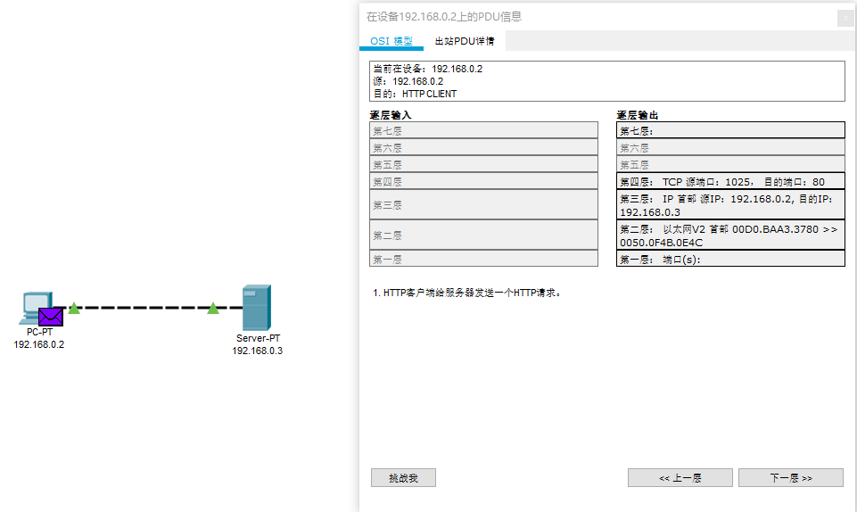

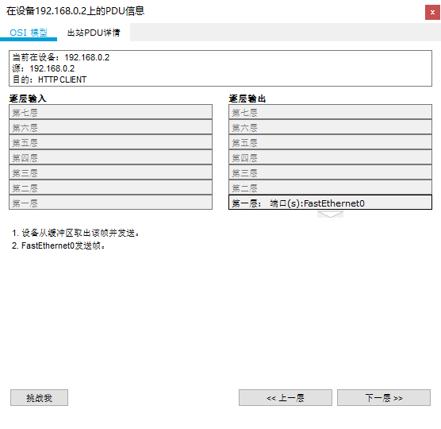

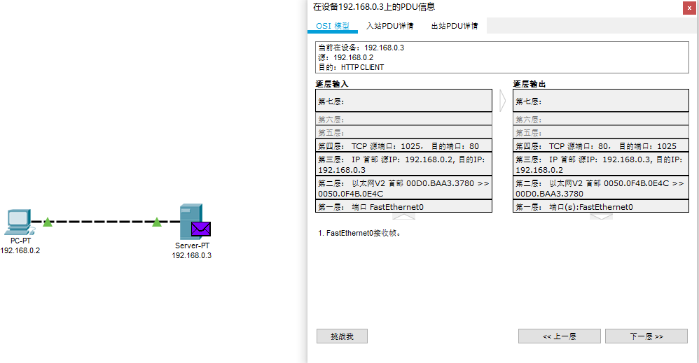

# 交换机与hub集线器

区别：

途经集线器的所有数据包都会被广播，分发给连接集线器的所有PC。只支持半双工，不能同时收发数据包。工作在物理层。

而交换机因为有自学习功能，在学习后能够定向转发数据包（即查mac表转发数据包，若mac表中找不到，则也会进行广播）。可以解决一些冲突域的产生。全双工，支持同时收发数据包。工作在数据链路层（也包括物理层）。交换机遇到多个帧碰撞，会存储所有碰撞帧，逐个发送，消除了碰撞。可以隔离碰撞域。

`市场上也有包含网络层部分功能的交换机 -- 三层交换机`

+ 帧的转发方式：存储转发和直接转发。

# 交换机自学习算法

交换机在自动记录发送给自己端口上所连的PC mac地址（mac地址具有存活时间），进行第二次请求能够定向转发。

记录原理：当数据包经过交换机时，交换机会记下发送PC的vlan、端口、mac地址。若MAC地址表中查找不到目标PC地址时，则交换机会发给同一vlan所有端口的PC（这种盲目转发方式叫做泛洪），当目标PC接收到数据包时返回响应，此时的目标PC就是一个发送PC，发送的响应数据包经过交换机时，先被记下vlan、mac、端口号，然后转发到目的地。vlan、mac、端口号最终形成的表就是交换机学习的成果。发送给交换机的那个端口不会转发给自己这个端口，它认为时不必要的。

网卡也能学习，记录的arp表包含**ip**、mac地址、**网卡号**。（注意与交换机区别，称为ARP高速缓存表）

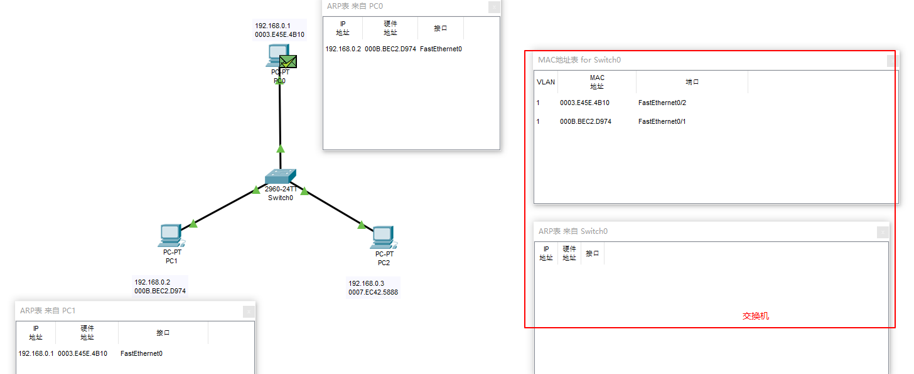

# 生成树协议STP的功能

提高以太网的可靠性，避免网络环路。

网络环路带来

+ **广播风暴**
+  收到重复广播，消耗主机资源
+ 交换机的帧交换表震荡，反复登记造成震荡

交换机使用生成树协议STP，能够自动计算并构建一个逻辑上没有环路的网络，最终生成的树型逻辑拓扑要确保连通整个网络。

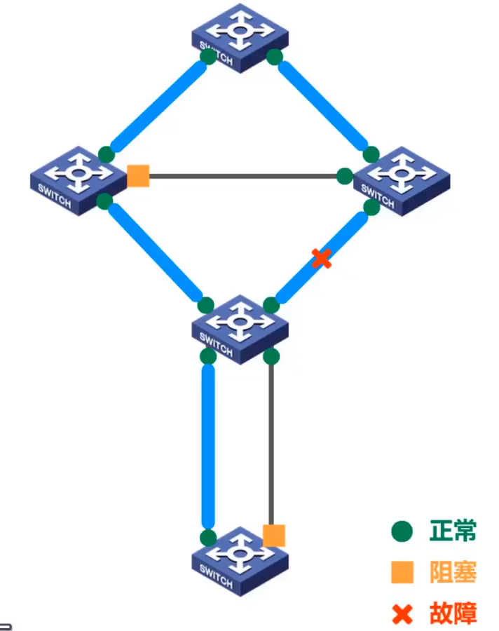