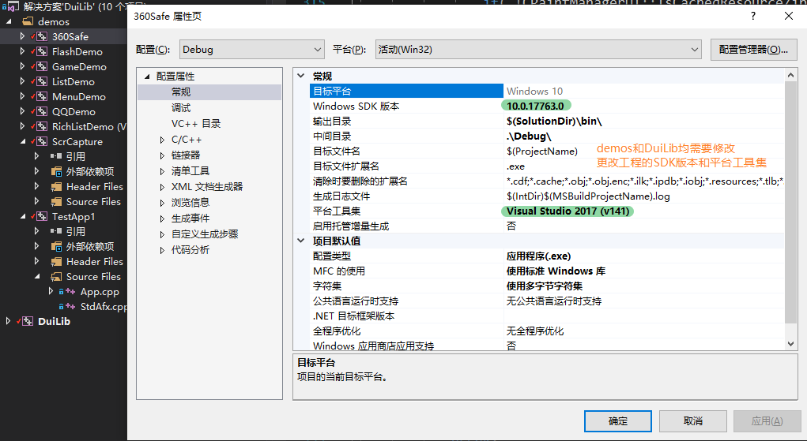
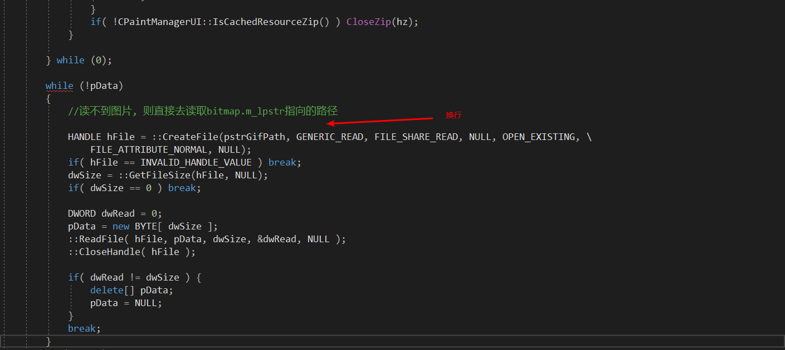

# Duilib

:email::q_tnt@qq.com

## Duilib 界面库编译 （C++）

[代码地址]: https://github.com/duilib/duilib.git

使用的是vs2017，记录一下解决的几个问题

问题1:找不到头文件等诸多问题

问题2:找不到hFile

问题3:找不到afxres.h

从网上下载一个放置在vs的工具集中

eg:C:\SSDSoftware\Microsoft Visual Studio\2017\Professional\VC\Tools\MSVC\14.16.27023\include

